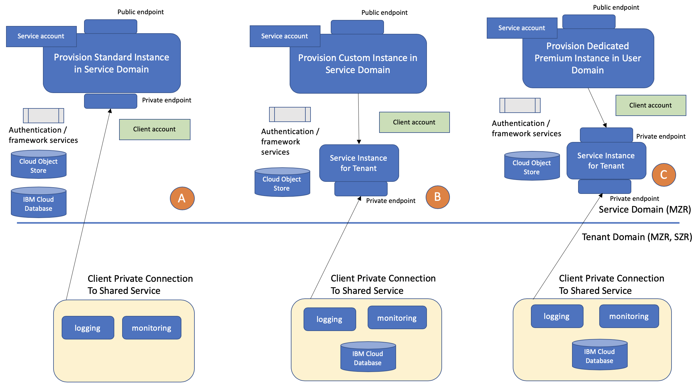

---
copyright:
  years: 2019
lastupdated: "2019-03-26"

keywords: about, IBM Cloud, Insights for Medical Literature

subcollection: wh-iml

---

# About
{: #about}
A provisioned instance of {{site.data.keyword.wh-iml_short}} using the Lite or Standard plan will provide the solution with access to the default corpus of close to 30 million articles including:
- Medline abstracts
- Clinical Trials
- Open Access Pubmed journal articles

The corpus is updated on a regular basis providing solutions with access to recently published articles.

##Enrichment
{: #enrichment}
The corpus is cognitively analyzed using the Unified Medical Language System [UMLS](https://www.nlm.nih.gov/research/umls/) that has been filtered to apply semantic types related to the medical domain and ignore more general types and concepts.  The corpus is fully refreshed annually after the National Institutes of Health releases the latest AA version of UMLS.  The corpus names will not change so general usability of APIs will not be affected but ontology artifacts can and will change or removed when new versions are released.

A premium plan should be provisioned for solutions that require control over the UMLS version for consistency as concepts can be removed or surface forms (synonyms) changed.

The default corpora also have been tagged with Medical Subject Headings [MeSH](https://www.nlm.nih.gov/mesh/meshhome.html).  MeSH is also updated annually and will be refreshed and applied to the corpus concurrently with UMLS.

A set of medical based attributes are also defined and applied when the corpus and updates are analyzed.  Attributes are a collection of artifacts from other ontologies or domain expert provided unique concepts that are combined into a single artifact for ease of use during corpus exploration and domain expert controlled coverage.

## Deployment Options
{{site.data.keyword.wh-iml_short}} has three deployment options that result in different combinations of computing, networking, and storage options as seen in the diagram below.

The first option (A) is to provision an instance of the service standard plan.  Such an instance will result in each tenant instance running in separate containers.  The service is accessible via a public endpoint.  The service will access all dependencies via private endpoints.

The second option (B) is to provision an instance of the service premium plan.  Such an instance will result in each tenant instance running on separate clusters and within separate containers for the clusters.  The service is accessible via a public endpoint.  The service will access all dependencies via private endpoints.  The service connects via private endpoint to a tenant provisioned repository in the client account space.

The third option (C) is to provision a dedicated instance of the service premium plan.  Such an instance will result in each tenant instance running on separate clusters and within separate containers for the cluster.  The dedicated instance can only be accessed via a private endpoint.  The service will access all dependencies via private endpoints.  The service connects via private endpoint to a tenant provisioned repository in the client account space.

{: caption="Figure 1 shows service deployment options and isolation"}

## Data isolation
{: #isolation}

Public multi-tenant instances do not have any user supplied configuration of contributed data.

Dedicated instances store user configuration data in Cloud Object Store isolated by tenant at the service layer.  Contributed data is stored in a tenant provisioned instance of Cloud Database for Elastic.

##HIPAA
{: #hippa}
US Health Insurance Portability and Accountability Act (HIPAA) support does not apply to the Insights for Medical Literature service.  The service is stateless and does not store any user data on {{site.data.keyword.cloud}}.